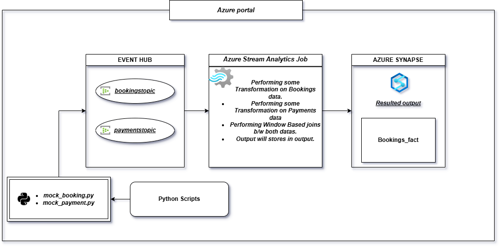

# BookmyShow_Stream_Analysis

   
   
   

## PROJECT OVERVIEW

The BookMyShow Stream Analysis project is designed to simulate a real-time data pipeline that processes booking and payment data. This project generates mock data streams for bookings and payments, ingests the data via Azure Event Hubs, processes it using Azure Stream Analytics with SQL transformations, and ultimately stores the processed data in an Azure Synapse Analytics table for analysis.

  
  

### PROJECT EXPLANATION :-  

 #### 1.Data Generation and Ingestion
  Two Python scripts generate mock booking and payment data using the Faker library:

  * <h4>Booking Data </h4>

   *  Generates data for each booking, including order ID, booking time, customer information, and event details.
   *  Data is pushed to the bookingtopic in Event Hubs every 5 seconds.

    
   * Payment Data (mock_payments.py):

   Generates corresponding payment data for each booking, including payment ID, order ID, amount, payment method, and status.
   Data is pushed to the paymenttopic in Event Hubs every 5 seconds.
   Each record is serialized into JSON format, encapsulated as EventData, and sent in real-time to the respective Event Hubs topics.

#### 2. Real-Time Data Processing with Stream Analytics
   Azure Stream Analytics performs SQL-based real-time transformations on the booking and payment data streams. This setup includes:

   Booking Data Transformation:
   Extracts information from the bookingtopic, including customer details, event information, seat number, price, and timestamp.
   Categorizes events based on names (e.g., concerts categorized as "Music").
   Calculates additional fields like booking_day_of_week and booking_hour for time-based analysis.
Example SQL Query Snippet:
sql
Copy code
WITH TransformedBookingStream AS (
    SELECT event.order_id, 
           TRY_CAST(event.booking_time AS datetime) AS booking_time,
           event.customer.customer_id,
           event.customer.name AS customer_name,
           ...
)
Payment Data Transformation:
Extracts and transforms payment records from the paymenttopic, including fields like payment method, amount, and payment time.
Aggregates the payment method into types (e.g., "Card" for credit/debit and "Online" for PayPal).
Example SQL Query Snippet:
sql
Copy code
WITH TransformedPaymentStream AS (
    SELECT payment_id,
           order_id,
           TRY_CAST(payment_time AS datetime) AS payment_time,
           ...
)
Joining Booking and Payment Data Streams:
The transformed booking and payment streams are joined on order_id, with a condition ensuring records are joined only if their timestamps differ by 2 minutes or less.
The combined data is selected for storage in Synapse.
Final SQL Query:
sql
Copy code
SELECT b.order_id, b.booking_time, ..., p.payment_time, ..., b.event_time, p.event_time
INTO [bookings-synapse]
FROM TransformedBookingStream b
JOIN TransformedPaymentStream p
ON b.order_id = p.order_id AND DATEDIFF(minute, b, p) BETWEEN 0 AND 2;
3. Data Storage in Azure Synapse Analytics
Processed booking and payment data is stored in a structured table within Azure Synapse Analytics:

Table Schema: The destination table, bookymyshow.bookings_fact, is structured to hold detailed information on bookings and payments.

SQL Schema Definition:
sql
Copy code
CREATE TABLE bookymyshow.bookings_fact (
    order_id NVARCHAR(50) NOT NULL,
    booking_time DATETIME2,
    customer_id NVARCHAR(50),
    customer_name NVARCHAR(100),
    ...
    payment_event_time DATETIME2
);
Data Storage and Querying: The enriched and processed data in Synapse can now be queried for insights, such as popular event categories, preferred payment methods, peak booking times, etc.

  
  
   
   
      

     

  

 
 
 

## ARCHITECTURE DIAGRAM :-

  

 
 
 

## TECHNOLOGY USED :-

<h3>SQL(Data Transformation):</h3>

    Used to write a queries for data transformation and perform joins.

<h3>Python(Data Generation):</h3>

   Two Python scripts generate mock data for bookings and payments.

<h3>Azure Event Hub(Streaming):</h3> 

  Event Hubs, acting like Kafka topics, ingest the generated booking and payment events.

<h3>Azure Synapse(Data Storage):</h3>

  Processed data is stored in an Azure Synapse Analytics table, creating a structured format for downstream analysis.

<h3>Azure Stream Analytics job:</h3>

  This is used for Real time Processing so SQL transformations are applied to the streaming data to filter, join, and enrich it.

 
 
 

## Project Files  :-
* <h3>Python-Scripts: </h3>
  <h4>It will generate bookings mock data:-</h4>
- [Python-code-snippet](mock_bookings.py)

   
  <h4>It will generate payments mock data:-</h4>
- [Python-code-snippet](mock_payments.py) 

  
  
 
*  <h3>Sql Scripts:</h3>
   <h4>SQL query for real-time data transformation.:</h4>
    https://github.com/aadarsh786/BookmyShow_Stream_Analysis/blob/main/stream_analytics_job_query.sql
     
   <h4>SQL script to create the destination table(bookings_fact) in Synapse Analytics:</h4>
    https://github.com/aadarsh786/BookmyShow_Stream_Analysis/blob/main/synapse_create_table.sql
  
  
  

   
   

  

